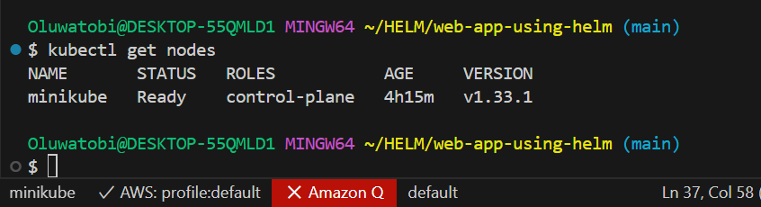
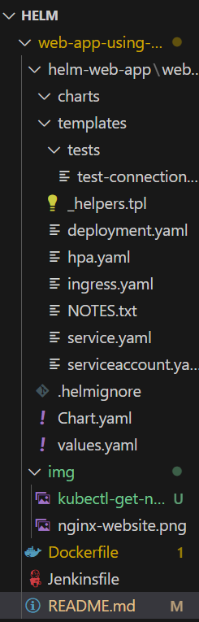
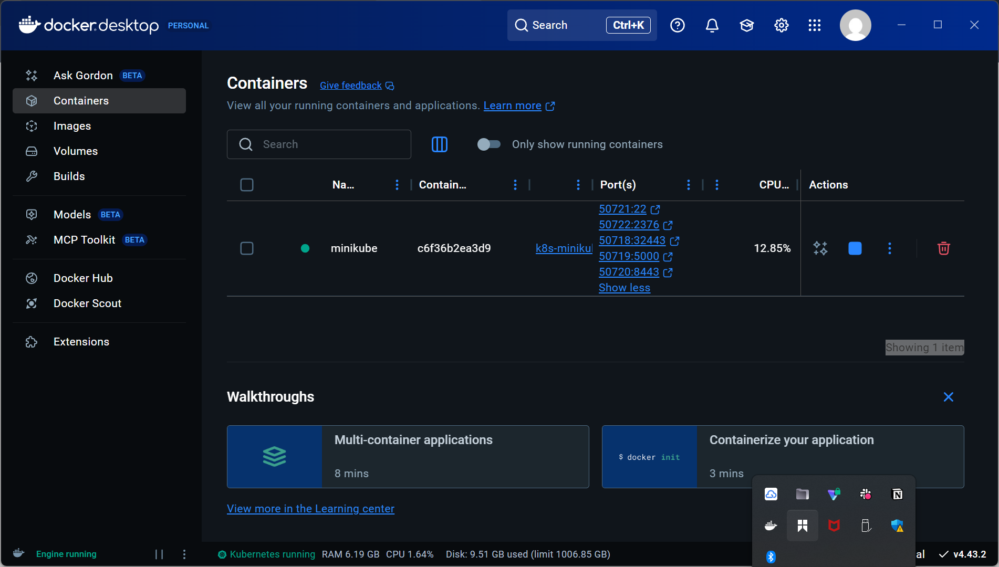
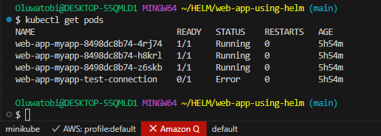
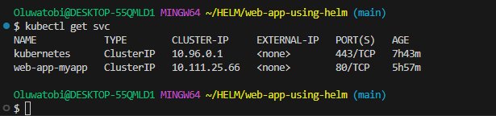
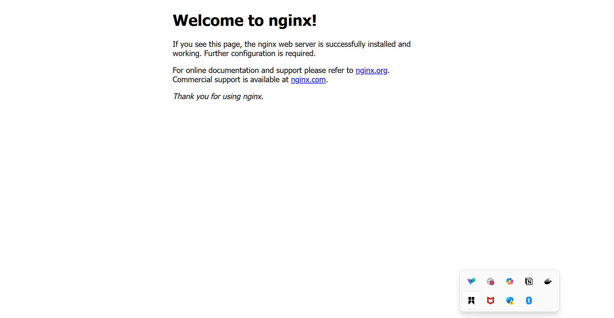
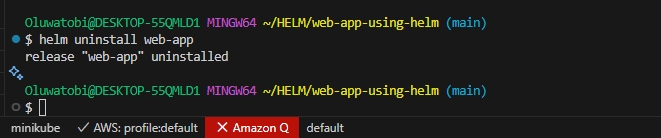

# 📘 Deploying a Web Application Using Helm in Kubernetes with Jenkins CI/CD

## 📌 Introduction

This project demonstrates how to deploy a web application to Kubernetes using **Helm** and automate the process with **Jenkins**. The workflow covers:

- Creating a Docker image of the application
- Pushing the image to a container registry
- Using Helm to manage Kubernetes deployments
- Automating the build and deployment with a Jenkins pipeline

## 📌 Project Objectives
The main goals of this project are:
1. **Automate** the build, test, and deployment process using **Jenkins**.
2. **Containerize** the application using **Docker** for consistency across environments.
3. **Deploy** the application to **Kubernetes** using automated manifests.
4. Enable **Continuous Integration & Continuous Deployment (CI/CD)** workflows.
5. Practice industry-standard DevOps tools and workflows.

---

## 📂 GitHub Repository
🔗 **Repository URL:** [https://github.com/Techytobii/web-app-using-helm.git](https://github.com/username/repo-name)


## 📄 Overview

**Workflow Steps:**
1. Developer pushes code to Git repository.
2. Jenkins pipeline triggers on new commit.
3. Docker image is built and pushed to registry.
4. Helm deploys/updates the Kubernetes resources.
5. Application becomes accessible via LoadBalancer/Ingress.

---

## ✅ Prerequisites

- Kubernetes cluster (Minikube, Kind, EKS, GKE, AKS, etc.)
- `kubectl` installed and configured
- Docker installed
- Helm installed
- Jenkins server with:
  - DockerHub credentials
  - kubeconfig credentials
  - Git integration
- Git repository containing application source code and Helm chart

🖼️ 
`kubectl get nodes`

---

## 🛠 Project Structure

```plaintext
web-app-using-helm/
│
├── helm-web-app/           # Helm chart folder
│   ├── charts/
│   ├── templates/
│   │   ├── _helpers.tpl
│   │   ├── deployment.yaml
│   │   ├── hpa.yaml
│   │   ├── ingress.yaml
│   │   ├── service.yaml
│   │   ├── serviceaccount.yaml
│   │   └── tests/
│   ├── .helmignore
│   ├── Chart.yaml
│   └── values.yaml
│
├── img/                    # Images or static assets
├── Jenkinsfile             # Jenkins pipeline configuration
├── Dockerfile              # Docker build instructions
├── README.md
└── .gitignore
````

🖼️ 

---

## 🐳 Dockerfile

**Node.js Example**

```dockerfile
# Use official Node.js image
FROM node:18-alpine

WORKDIR /app

COPY package*.json ./
RUN npm install --production

COPY . .

EXPOSE 3000

CMD ["npm", "start"]
```


---

## 📦 Helm Deployment File (`helm-web-app/templates/deployment.yaml`)

```yaml
apiVersion: apps/v1
kind: Deployment
metadata:
  name: {{ include "helm-web-app.fullname" . }}
  labels:
    app: {{ include "helm-web-app.name" . }}
spec:
  replicas: {{ .Values.replicaCount }}
  selector:
    matchLabels:
      app: {{ include "helm-web-app.name" . }}
  template:
    metadata:
      labels:
        app: {{ include "helm-web-app.name" . }}
    spec:
      containers:
        - name: {{ .Chart.Name }}
          image: "{{ .Values.image.repository }}:{{ .Values.image.tag }}"
          ports:
            - containerPort: {{ .Values.service.port }}
          resources:
            {{- toYaml .Values.resources | nindent 12 }}
```

---

## 🔄 Jenkinsfile

```groovy
pipeline {
  agent any
  environment {
    // optionally: HELM_EXPERIMENTAL_OCI=1 if you use OCI charts
  }
  stages {
    stage('Checkout') {
      steps { checkout scm }
    }

    stage('Build & Push Image (optional)') {
      when { expression { return fileExists('Dockerfile') } }
      steps {
        script {
          // requires Docker plugin or run on agent with docker available
          def img = docker.build("myorg/myapp:${env.BUILD_NUMBER}")
          docker.withRegistry('https://index.docker.io/v1/', 'docker-hub-creds') {
            img.push()
          }
          // store for later
          env.IMAGE = "myorg/myapp:${env.BUILD_NUMBER}"
        }
      }
    }

    stage('Deploy with Helm') {
      steps {
        // 'kubeconfig-dev' is the credentials ID you created (Secret file)
        withCredentials([file(credentialsId: 'kubeconfig-dev', variable: 'KUBECONFIG_FILE')]) {
          sh '''
            export KUBECONFIG="$KUBECONFIG_FILE"
            helm repo add mycharts https://charts.example.com || true
            helm repo update
            helm lint ./chart
            helm upgrade --install myapp-dev ./chart \
              --namespace dev --create-namespace \
              --set image.repository=myorg/myapp \
              --set image.tag=${BUILD_NUMBER} \
              --values values-dev.yaml \
              --wait --timeout 10m
          '''
        }
      }
    }
  }
}
```


---

## 🚀 Deployment

**Manual Helm deploy:**

```bash
helm install web-app ./helm-web-app
```

**View status:**

```bash
helm list
kubectl get pods
kubectl get svc
```

 

`kubectl get pods`
Kubernetes pods running

`kubectl get svc`


Kubernetes service details
---
## Nginx Web Output


---

## 🧹 Cleanup

```bash
helm uninstall web-app
```


---

## ⚠ Challenges Faced

During the project, the following issues were encountered and resolved:

1. **Helm Template Errors**

   * Cause: Incorrect indentation in `deployment.yaml`.
   * Solution: Used `nindent` in Helm templates to fix YAML formatting.

2. **Image Pull Failures**

   * Cause: Docker image not pushed before Helm deployment.
   * Solution: Reordered Jenkins pipeline to push image before `helm upgrade`.

3. **Kubeconfig Authentication Issues**

   * Cause: Jenkins unable to connect to Kubernetes cluster.
   * Solution: Stored kubeconfig file as Jenkins credential and exported in deploy stage.

4. **LoadBalancer Delay**

   * Cause: Cloud provider provisioning delay.
   * Solution: Waited for external IP to be assigned and verified service.

---

## 📓 Conclusion

By combining **Helm** and **Jenkins**, we automated the build and deployment process for a Kubernetes application. This approach ensures:

* Consistency in deployments
* Versioned and repeatable application releases
* Minimal manual intervention

This setup is suitable for production-grade CI/CD pipelines with Kubernetes.
```

---


📘 Deploying a Web Application Using Helm in Kubernetes with Jenkins CI/CD
📌 Introduction
This project demonstrates deploying a web application to Kubernetes using Helm, with automation via Jenkins. It includes:

Building a Docker image

Pushing it to a container registry

Deploying to Kubernetes with Helm

Automating with a Jenkins pipeline

Managing revisions and rollbacks with Helm

📌 Project Objectives
Automate build, test, and deployment with Jenkins.

Containerize the app using Docker for environment consistency.

Deploy & manage Kubernetes resources via Helm.

Enable CI/CD workflows.

Practice industry-standard DevOps practices including rollback handling.

📂 GitHub Repository
🔗 Repository URL: https://github.com/Techytobii/web-app-using-helm.git

📄 Updated Overview
Current workflow:

Developer pushes code to GitHub.

Jenkins pipeline triggers.

Docker image built and pushed to registry.

Helm deploys/updates release myrel in the dev namespace from the ./chart directory.

Application accessible via port-forward or LoadBalancer.

Helm revision history maintained for rollbacks.

✅ Prerequisites
Minikube cluster (Docker driver)

kubectl installed and configured

Docker installed and running

Helm installed (v3+)

Jenkins with:

DockerHub credentials

kubeconfig file credential

Git integration

Application source + Helm chart in repo

🛠 Project Structure
plaintext
Copy
Edit
web-app-using-helm/
│
├── chart/                   # Helm chart folder
│   ├── templates/
│   │   ├── deployment.yaml
│   │   ├── service.yaml
│   │   ├── ingress.yaml
│   │   └── _helpers.tpl
│   ├── Chart.yaml
│   └── values.yaml
├── Jenkinsfile
├── Dockerfile
├── img/
└── README.md
🐳 Dockerfile (Node.js Example)
dockerfile
Copy
Edit
FROM node:18-alpine
WORKDIR /app
COPY package*.json ./
RUN npm install --production
COPY . .
EXPOSE 3000
CMD ["npm", "start"]
📦 Helm Deployment (chart/templates/deployment.yaml)
yaml
Copy
Edit
apiVersion: apps/v1
kind: Deployment
metadata:
  name: {{ include "chart.fullname" . }}
  labels:
    app: {{ include "chart.name" . }}
spec:
  replicas: {{ .Values.replicaCount }}
  selector:
    matchLabels:
      app: {{ include "chart.name" . }}
  template:
    metadata:
      labels:
        app: {{ include "chart.name" . }}
    spec:
      containers:
        - name: {{ .Chart.Name }}
          image: "{{ .Values.image.repository }}:{{ .Values.image.tag }}"
          ports:
            - containerPort: {{ .Values.service.port }}
🔄 Jenkinsfile (Updated)
groovy
Copy
Edit
pipeline {
    agent any

    environment {
        DOCKERHUB_USER = credentials('dockerhub-username')
        DOCKERHUB_PASS = credentials('dockerhub-password')
        DOCKER_IMAGE = "mydockerhubuser/my-webapp"
        KUBE_CONFIG = credentials('kubeconfig-credential')
    }

    stages {
        stage('Checkout') {
            steps {
                git branch: 'main', url: 'https://github.com/Techytobii/web-app-using-helm.git'
            }
        }

        stage('Build Docker Image') {
            steps {
                sh 'docker build -t $DOCKER_IMAGE:$BUILD_NUMBER .'
            }
        }

        stage('Push Docker Image') {
            steps {
                sh 'echo $DOCKERHUB_PASS | docker login -u $DOCKERHUB_USER --password-stdin'
                sh 'docker push $DOCKER_IMAGE:$BUILD_NUMBER'
            }
        }

        stage('Deploy to Kubernetes') {
            steps {
                withCredentials([file(credentialsId: 'kubeconfig-credential', variable: 'KUBECONFIG_FILE')]) {
                    sh '''
                        export KUBECONFIG=$KUBECONFIG_FILE
                        helm upgrade --install myrel ./chart \
                            --namespace dev --create-namespace \
                            --set image.repository=$DOCKER_IMAGE \
                            --set image.tag=$BUILD_NUMBER \
                            --values ./chart/values.yaml
                    '''
                }
            }
        }
    }
}
🚀 Deployment Steps (Manual)
bash
Copy
Edit
# Install release
helm upgrade --install myrel ./chart \
  --namespace dev --create-namespace \
  --values ./chart/values.yaml

# Check status
helm status myrel -n dev
helm list -n dev

# Port-forward to access locally
export POD_NAME=$(kubectl get pods -n dev -l app=myrel -o jsonpath="{.items[0].metadata.name}")
kubectl -n dev port-forward $POD_NAME 8080:3000
🔄 Rollback Example
bash
Copy
Edit
# Check history
helm history myrel -n dev

# Roll back to revision 1
helm rollback myrel 1 -n dev

# Verify
helm status myrel -n dev
🧹 Cleanup
bash
Copy
Edit
helm uninstall myrel -n dev
⚠ Updated Challenges
values.yaml not found

Cause: Wrong path in helm command

Fix: Used --values ./chart/values.yaml

Release not found for rollback

Cause: No previous revision existed

Fix: Made multiple upgrades before rollback

Docker connection issue with Minikube

Cause: Docker Desktop not running

Fix: Switched to Minikube with proper driver

Kubectl context mismatch

Cause: Stale Minikube port in kubeconfig

Fix: Ran minikube update-context

📓 Conclusion
We now have a fully automated Helm deployment pipeline via Jenkins that works on Minikube, with tested upgrade and rollback functionality. This mirrors production-ready workflows while remaining simple enough for local development and testing.